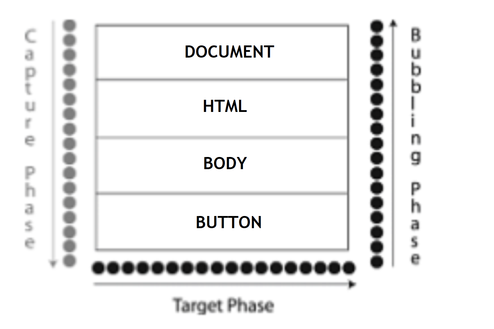
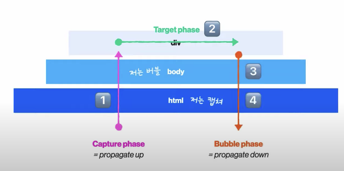

# HTML

## DOM Events

DOM의 한 엘리먼트에 이벤트를 지정하면, 해당 이벤트에 무엇을 할지에 대한 이벤트 핸들러를 명시해줘야 한다. `addEventListener()`를 통해 이벤트를 지정하고 어떤 액션을 취할 것인지 프로그래밍할 수 있다.

> **Event Handler
= Event Listener
= Event Callback Function**

예) elementDiv(주체)에게 '클릭' 이벤트가 일어나면 콘솔에 문자열을 출력하겠다.

```jsx
elementDiv.addEventListener('click', function() {
	console.log('fire/trigger addEvent');
});
```

### DOM Event Types

DOM 이벤트는 다양하다. 아래의 이벤트들은 개발하면서 많이 쓰일 이벤트를 정리한 것이고, 나머지 이벤트는 필요할 때마다 검색해보자.

⚬ *User interface events*

- load
- scroll
- resize

⚬ *Form events*

- change
- submit

⚬ *Focus events*

- blur
- focus

⚬ *Key events*

- keydown
- keyup

⚬ *Mouse events*

- click
- mousedown
- mouseup
- mouseenter (마우스 진입)
- mouseleave (마우스 이탈)

⚬ *Mobile events*

- touchstart
- touchend
- touchmove

## DOM Event Flow

사용자가 DOM 요소 중 하나를 눌렀을 때, 해당 요소에 이벤트가 선언되어 있다고 생각해보자. 그러면 어떤 일이 발생할까?

```jsx
<!DOCTYPE HTML>
<html>
<head>
    ...
</head>
<body>
    <button id="demo">
        Press here
    </button>
</body>
</html>
```



### 버블링(Bubble phase) - propagate down

> **만약, DOM에서 button을 눌렀다면, button의 onClick만 실행이 될까?**

*답은 아니다.* 답은 buttom > body > html > document 순으로 **부모 요소의 모든 onClick handler가 실행된다**. 이를 '**버블링(Bubbling)**'이라고 한다. 

위의 DOM Event Flow는 아래와 같은 두 가지 target 개념을 발생시킨다.

- **Current target** = 이벤트의 현재(진짜) 주인
- **Target** = 이벤트의 시발점(누구 때문에 시작되었는가?)

> **무슨 의미일까?**

buttom > body > html > document 순으로 실행된다고 언급했다. current target은 버블링되는 요소를 따라간다. target은 이벤트의 시발점만을 가르킨다는 차이가 있다. 

### 캡쳐링(Capture phase) - propagate up

캡쳐링은 버블의 반대이다. 최상위 부모 요소로부터 클릭된 요소의 최하위까지 이벤트가 흘러가는 것을 의마한다. 위의 예시로 말하자면, document> html > body > buttom 순으로 발생한다. **모든 이벤트 흐름의 기본 설정은 버블링**이어서 사실상 거의 사용하지 않는다. 그래도 캡쳐링이라는 개념이 있다는 것을 알아두자!

### 대상(Target phase)

사용자가 클릭했던 요소의 이벤트이다.

### 정리

**모든 이벤트는 캡쳐링 > 타겟 > 버블링 순으로 흐른다**. 즉 요소 한 번 이벤트를 반생시키면 DOM은 엄청나게 많은 동작을 하게 된다는 것이다. **브라우져도 이를 알고 있으며 버블링을 기본값으로 설정**되어 있다. 여기서 **중요한 점은 캡쳐링이 일어나지 않는 것은 아니다. 버블링되는 순간에 이벤트가 발생되는 것일 뿐**!!!



[출처] 개발자이자 유투버 '김버그 Kimbug'님 강의 자료

## Event Propagation(이벤트 전파)

> **이벤트의 흐름을 내가 제어할 수 있을까? 있다면 방법은?**

당연히 존재한다. `stopPropagation()` 와 `preventDefault()` 이다. 자주 사용되므로 조금 정리해보자!

### event.stopPropagation()

캡쳐링, 버블링을 바로 막아버리는 메서드이다. (버블링 기준) 부모 요소의 동일 이벤트가 실행되는 것을 막고 싶다면, 이 메서드를 통해 쉽게 막을 수 있다.

### event.preventDefault()

체크박스를 클릭 했을 때, 이것을 막고 싶을 때가 있다. 왜? 그냥 로직상 특정 조건을 만족시켰을 때, 체크되어야할 경우도 있기 때문이다. 이럴 경우 `preventDefault` 를 사용하면 된다. 나는 보통 `input`에서 enter keydown을 막는다던가? 기다린다던가? 할 때 주로 사용한다 😁